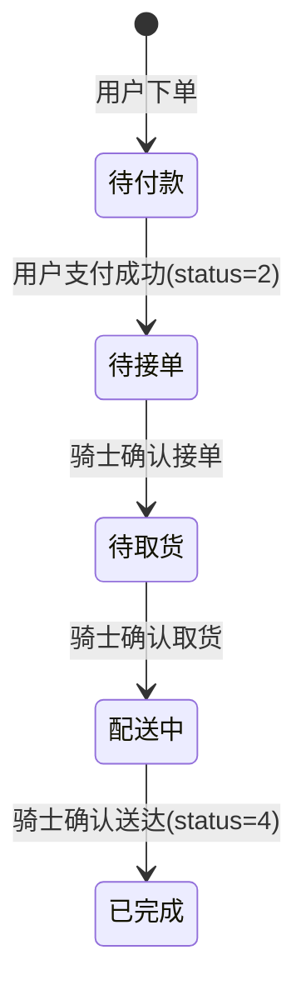
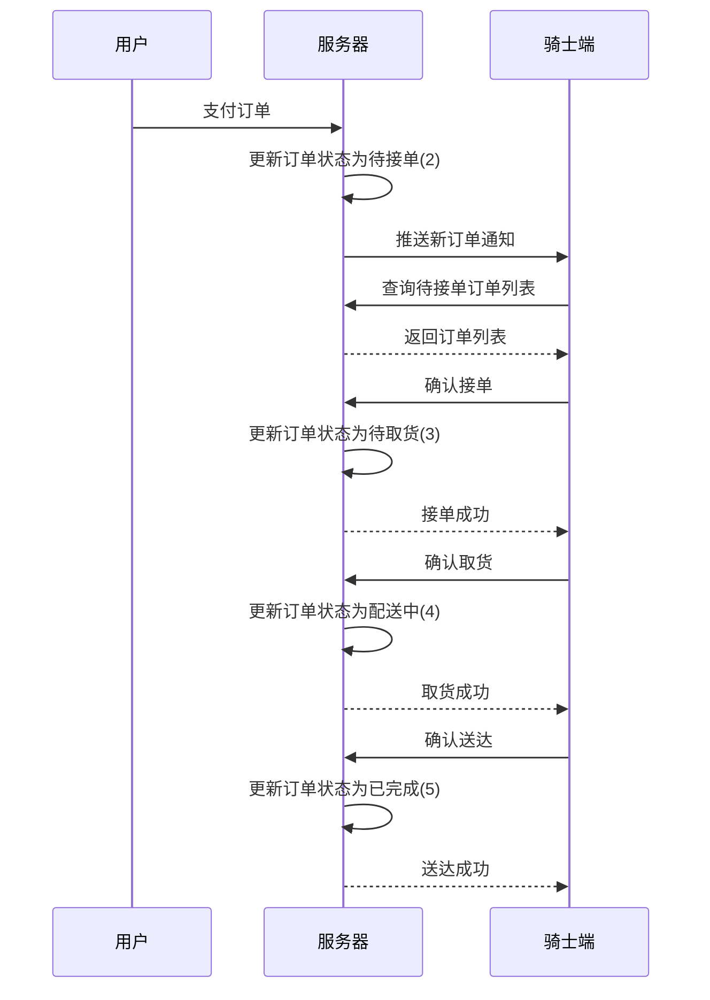

# 骑士端需求分析文档

## 1. 项目概述

### 1.1 背景
基于现有蛋糕商城项目，新增骑士端模块，实现订单配送全流程管理。骑士端作为连接商家与用户的重要环节，负责订单的取货、配送和送达确认。

### 1.2 项目目标
- 提供骑士登录和身份验证功能
- 实现订单状态流转管理（待接单→待取货→配送中→已完成）
- 提供订单详情查看和配送操作功能
- 实现骑士收入统计和消息通知功能

### 1.3 技术架构
| 层级 | 技术选型 |
|------|----------|
| 前端框架 | Spring Boot + Thymeleaf |
| 后端框架 | Spring Boot 2.2.6 |
| 数据库 | MySQL 8.0+ |
| ORM框架 | MyBatis Plus 3.5.0 |
| 构建工具 | Maven |

---

## 2. 功能需求分析

### 2.1 核心功能模块

| 模块 | 功能描述 | 优先级 |
|------|----------|--------|
| 骑士登录 | 骑士账号密码登录、退出 | 高 |
| 订单管理 | 待接单、待取货、配送中、已完成订单列表 | 高 |
| 订单操作 | 确认接单、确认取货、确认送达 | 高 |
| 订单详情 | 查看订单详细信息（商品、收货人、地址等） | 高 |
| 收入统计 | 查看配送收入明细和统计 | 中 |
| 消息通知 | 接收订单推送和系统通知 | 中 |
| 个人中心 | 骑士信息查看和修改 | 低 |

### 2.2 页面结构

```
骑士端
├── 登录页 (knight/login)
├── 首页 (knight/index)
│   ├── 统计卡片（待接单、待取货、配送中、已完成）
│   └── 订单列表（可切换状态筛选）
├── 订单详情页 (knight/orderDetail)
├── 收入页 (knight/income)
├── 消息页 (knight/message)
└── 个人中心页 (knight/profile)
```

### 2.3 用户故事

#### US-001: 骑士登录
| 项目 | 描述 |
|------|------|
| ID | US-001 |
| 标题 | 骑士登录功能 |
| 描述 | 作为骑士，我需要登录系统，以便查看和处理配送订单 |
| 验收标准 | 1. 输入账号密码后可成功登录<br>2. 登录失败显示错误提示<br>3. 登录成功后跳转首页 |
| 优先级 | 高 |

#### US-002: 订单状态统计
| 项目 | 描述 |
|------|------|
| ID | US-002 |
| 标题 | 订单状态统计卡片 |
| 描述 | 作为骑士，我需要在首页快速查看各状态订单数量 |
| 验收标准 | 1. 显示待接单、待取货、配送中、已完成数量<br>2. 数字实时更新<br>3. 点击卡片可筛选对应状态订单 |
| 优先级 | 高 |

#### US-003: 待接单订单列表
| 项目 | 描述 |
|------|------|
| ID | US-003 |
| 标题 | 待接单订单列表展示 |
| 描述 | 作为骑士，我需要查看待接单订单列表，选择订单进行配送 |
| 验收标准 | 1. 显示订单号、商品数量、地址、电话、时间、金额<br>2. 支持按时间排序<br>3. 显示"确认接单"按钮 |
| 优先级 | 高 |

#### US-004: 确认接单
| 项目 | 描述 |
|------|------|
| ID | US-004 |
| 标题 | 确认接单操作 |
| 描述 | 作为骑士，我需要确认接单，将订单状态改为待取货 |
| 验收标准 | 1. 点击"确认接单"后订单状态更新<br>2. 订单从待接单列表转移到待取货列表<br>3. 提示接单成功 |
| 优先级 | 高 |

#### US-005: 待取货订单列表
| 项目 | 描述 |
|------|------|
| ID | US-005 |
| 标题 | 待取货订单列表展示 |
| 描述 | 作为骑士，我需要查看已接单待取货的订单列表 |
| 验收标准 | 1. 显示订单号、商品数量、取货地址、电话、金额<br>2. 显示"确认取货"按钮 |
| 优先级 | 高 |

#### US-006: 确认取货
| 项目 | 描述 |
|------|------|
| ID | US-006 |
| 标题 | 确认取货操作 |
| 描述 | 作为骑士，我需要确认已取货，将订单状态改为配送中 |
| 验收标准 | 1. 点击"确认取货"后订单状态更新<br>2. 订单从待取货列表转移到配送中列表<br>3. 提示取货成功 |
| 优先级 | 高 |

#### US-007: 配送中订单列表
| 项目 | 描述 |
|------|------|
| ID | US-007 |
| 标题 | 配送中订单列表展示 |
| 描述 | 作为骑士，我需要查看正在配送的订单列表 |
| 验收标准 | 1. 显示订单号、商品数量、收货地址、电话、金额<br>2. 显示"确认送达"按钮 |
| 优先级 | 高 |

#### US-008: 确认送达
| 项目 | 描述 |
|------|------|
| ID | US-008 |
| 标题 | 确认送达操作 |
| 描述 | 作为骑士，我需要确认订单已送达，将订单状态改为已完成 |
| 验收标准 | 1. 点击"确认送达"后订单状态更新<br>2. 订单从配送中列表转移到已完成列表<br>3. 提示送达成功 |
| 优先级 | 高 |

#### US-009: 已完成订单列表
| 项目 | 描述 |
|------|------|
| ID | US-009 |
| 标题 | 已完成订单列表展示 |
| 描述 | 作为骑士，我需要查看已完成配送的订单历史记录 |
| 验收标准 | 1. 显示订单号、完成时间、金额<br>2. 支持按时间筛选 |
| 优先级 | 中 |

#### US-010: 订单详情查看
| 项目 | 描述 |
|------|------|
| ID | US-010 |
| 标题 | 订单详情查看 |
| 描述 | 作为骑士，我需要查看订单详细信息，包括商品明细和收货人信息 |
| 验收标准 | 1. 显示订单基本信息（订单号、创建时间、状态）<br>2. 显示商品列表（商品名称、数量、单价）<br>3. 显示收货人信息（姓名、电话、地址）<br>4. 显示订单金额 |
| 优先级 | 高 |

#### US-011: 收入统计
| 项目 | 描述 |
|------|------|
| ID | US-011 |
| 标题 | 骑士收入统计 |
| 描述 | 作为骑士，我需要查看配送收入明细和统计 |
| 验收标准 | 1. 显示今日收入、本周收入、本月收入<br>2. 显示收入明细列表<br>3. 支持按时间筛选 |
| 优先级 | 中 |

#### US-012: 消息通知
| 项目 | 描述 |
|------|------|
| ID | US-012 |
| 标题 | 消息通知功能 |
| 描述 | 作为骑士，我需要接收订单推送和系统通知消息 |
| 验收标准 | 1. 显示未读消息数量<br>2. 消息列表按时间排序<br>3. 支持标记已读 |
| 优先级 | 中 |

#### US-013: 个人中心
| 项目 | 描述 |
|------|------|
| ID | US-013 |
| 标题 | 骑士个人中心 |
| 描述 | 作为骑士，我需要查看和修改个人信息 |
| 验收标准 | 1. 显示骑士头像、姓名、手机号<br>2. 支持修改密码<br>3. 显示配送统计数据 |
| 优先级 | 低 |

---

## 3. 数据流与状态流转

### 3.1 订单状态流转图



### 3.2 订单状态映射表

| 状态值 | 状态名称 | 说明 |
|--------|----------|------|
| 0 | 待付款 | 用户未支付 |
| 2 | 待接单 | 用户已支付，等待骑士接单 |
| 3 | 待取货 | 骑士已接单，等待取货 |
| 4 | 配送中 | 骑士已取货，正在配送 |
| 5 | 已完成 | 订单已送达 |

---

## 4. 数据库设计

### 4.1 骑士表 (knight)

| 字段名 | 类型 | 约束 | 说明 |
|--------|------|------|------|
| id | VARCHAR(50) | PRIMARY KEY | 骑士ID |
| username | VARCHAR(50) | NOT NULL | 账号 |
| password | VARCHAR(100) | NOT NULL | 密码（加密） |
| name | VARCHAR(50) | NOT NULL | 姓名 |
| phone | VARCHAR(20) | NOT NULL | 手机号 |
| avatar | VARCHAR(255) | | 头像URL |
| status | INT | DEFAULT 1 | 状态（1-在线，0-离线） |
| create_time | DATETIME | | 创建时间 |
| update_time | DATETIME | | 更新时间 |

### 4.2 订单表扩展字段

现有订单表 `order` 需要新增字段：

| 字段名 | 类型 | 约束 | 说明 |
|--------|------|------|------|
| knight_id | VARCHAR(50) | | 配送骑士ID |
| knight_name | VARCHAR(50) | | 骑士姓名 |
| knight_phone | VARCHAR(20) | | 骑士电话 |
| pickup_time | DATETIME | | 取货时间 |
| delivery_time | DATETIME | | 送达时间 |

---

## 5. 接口设计

### 5.1 骑士认证接口

| API路径 | HTTP方法 | 功能描述 |
|---------|----------|----------|
| `/knight/login` | POST | 骑士登录 |
| `/knight/logout` | GET | 骑士退出 |

### 5.2 订单管理接口

| API路径 | HTTP方法 | 功能描述 |
|---------|----------|----------|
| `/knight/orders` | GET | 获取订单列表（按状态筛选） |
| `/knight/orders/{orderId}` | GET | 获取订单详情 |
| `/knight/orders/{orderId}/accept` | POST | 确认接单 |
| `/knight/orders/{orderId}/pickup` | POST | 确认取货 |
| `/knight/orders/{orderId}/deliver` | POST | 确认送达 |

### 5.3 收入统计接口

| API路径 | HTTP方法 | 功能描述 |
|---------|----------|----------|
| `/knight/income` | GET | 获取收入统计 |
| `/knight/income/detail` | GET | 获取收入明细 |

### 5.4 消息通知接口

| API路径 | HTTP方法 | 功能描述 |
|---------|----------|----------|
| `/knight/messages` | GET | 获取消息列表 |
| `/knight/messages/{messageId}` | PUT | 标记消息已读 |

### 5.5 个人中心接口

| API路径 | HTTP方法 | 功能描述 |
|---------|----------|----------|
| `/knight/profile` | GET | 获取骑士信息 |
| `/knight/profile` | PUT | 更新骑士信息 |
| `/knight/profile/password` | PUT | 修改密码 |

---

## 6. 页面原型说明

根据提供的概念图，页面布局如下：

### 6.1 首页布局

```
┌─────────────────────────────────────────────────────────────┐
│ 骑士端                              张三  退出              │
├──────┬──────┬──────┬──────┬─────────────────────────────────┤
│  19  │  0   │  0   │  0   │                                 │
│待接单 │待取货 │配送中 │已完成│                                 │
├──────┴──────┴──────┴──────┴─────────────────────────────────┤
│ 待接单 ▼  │ 待取货 │ 配送中 │ 已完成                         │
├─────────────────────────────────────────────────────────────┤
│ 订单号:#1779421284                          待取货         │
│ ───────────────────────────────────────────────────────────│
│ 商品数量:1件                                                │
│ 福州                                                       │
│ czh                                                        │
│ 123456                                                     │
│ 2026-05-22 11:41:24                                        │
│ ¥39.0                                    查看详情 │ 确认取货│
├─────────────────────────────────────────────────────────────┤
│ 首页 │ 收入 │ 消息 │ 我的                                   │
└─────────────────────────────────────────────────────────────┘
```

---

## 7. 非功能需求

### 7.1 性能需求
- 页面响应时间 < 2秒
- 订单状态更新实时同步

### 7.2 安全性需求
- 骑士密码加密存储
- 登录会话管理
- 接口访问权限控制

### 7.3 兼容性需求
- 支持主流浏览器（Chrome、Firefox、Safari）
- 支持移动端访问

---

## 8. 与现有系统的集成

### 8.1 订单状态联动

| 操作方 | 操作 | 订单状态变化 | 骑士端影响 |
|--------|------|--------------|------------|
| 用户 | 支付成功 | 0 → 2 | 待接单列表新增订单 |
| 骑士 | 确认接单 | 2 → 3 | 待接单→待取货 |
| 骑士 | 确认取货 | 3 → 4 | 待取货→配送中 |
| 骑士 | 确认送达 | 4 → 5 | 配送中→已完成 |

### 8.2 数据交互流程



---

## 9. 开发计划

### 9.1 任务分解

| 阶段 | 任务 | 预估时长 |
|------|------|----------|
| 第一阶段 | 骑士表设计与创建 | 1天 |
| 第一阶段 | 订单表扩展字段 | 0.5天 |
| 第二阶段 | 骑士实体类和Mapper | 1天 |
| 第二阶段 | 骑士Service层实现 | 1天 |
| 第三阶段 | 骑士Controller层实现 | 2天 |
| 第四阶段 | 骑士端页面开发 | 3天 |
| 第五阶段 | 测试与联调 | 2天 |

### 9.2 依赖关系


